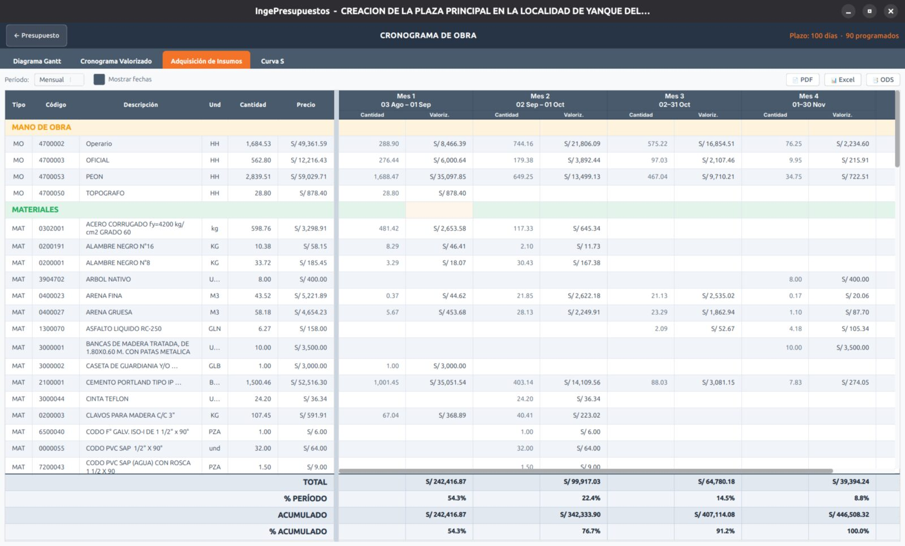

# Adquisición de insumos

El cronograma de **adquisiciones** te dice **qué insumos comprar y cuándo**, repartiendo el consumo de cada recurso según el avance programado de las partidas que lo usan.

## Para qué sirve

- Planificar las **compras** mes a mes.
- Anticipar el **flujo de caja** de materiales y equipos.
- Coordinar la logística de la obra.

Para cada insumo y cada período verás:

- **Cantidad** a adquirir en el período.
- **Valorización** (el monto en S/).

Y los totales por insumo y por período.
