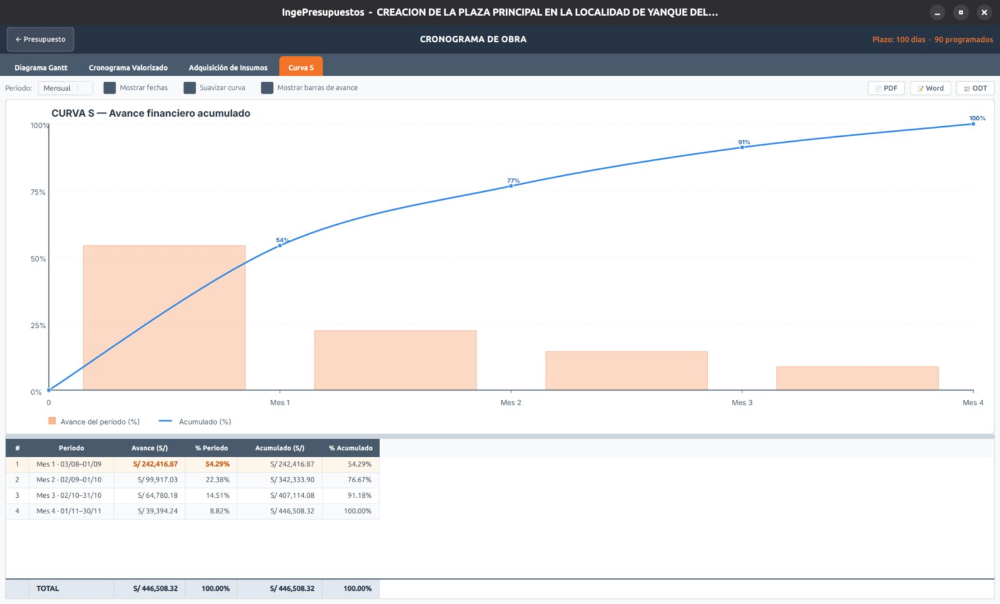

# Curva S

La **Curva S** representa el **avance acumulado** de la obra en el tiempo. Toma su nombre de la forma típica de la curva: lento al inicio, acelerado al medio y lento al final.

## Qué muestra

- El **avance programado acumulado** (en % o en S/) período a período.
- Una **tabla** con los valores por período y el acumulado.

Es una herramienta clave para el control de obra: durante la ejecución, comparas el avance real contra esta curva programada para ver si vas adelantado o atrasado.

!!! note "Se calcula desde el cronograma valorizado"
    La Curva S se deriva del [cronograma valorizado](valorizado.md): es su acumulado. Si cambias la programación en el Gantt, la curva se actualiza.
