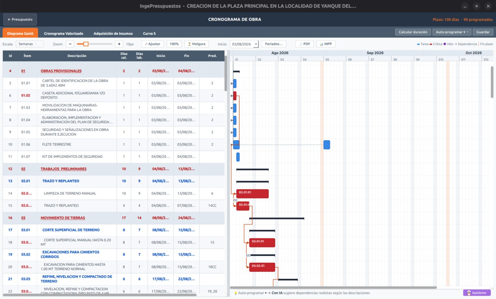

# Diagrama de Gantt

El **Gantt** de IngePresupuestos funciona al estilo de MS Project: tareas con barras en el tiempo, dependencias entre ellas, holguras, hitos y **ruta crítica**.

## La tabla y el gráfico

A la izquierda tienes la tabla de tareas (número, descripción, duración, inicio, fin, predecesoras) y a la derecha las barras en el calendario. La columna **#** numera todas las filas por posición, incluyendo:

- **#1** el proyecto,
- **#2** el hito de Inicio (puedes referenciarlo como predecesora),
- las cabeceras de cada subpresupuesto,
- las partidas,
- y el hito de **Fin**.

## Dependencias

Defines qué tarea depende de cuál con la notación en español:

| Notación | Significado |
|----------|-------------|
| **FC** | Fin → Comienzo (la más común). |
| **CC** | Comienzo → Comienzo. |
| **FF** | Fin → Fin. |
| **CF** | Comienzo → Fin. |

Puedes agregar **desfase** (lag) y porcentaje. Las predecesoras se escriben por el número de fila (ej. `5FC`, `5FC+3d`).

## Ruta crítica y holguras

IngePresupuestos calcula la **ruta crítica** (las tareas que no pueden retrasarse sin atrasar la obra) y las **holguras** de las demás. Las tareas críticas se resaltan.

## Hitos

Puedes marcar tareas como **hitos** (puntos de control sin duración) para señalar entregas o etapas clave.

!!! tip "Para imprimir"
    El Gantt se imprime con un formato propio que ajusta el tamaño de papel automáticamente (de A4 hasta A0) según la cantidad de tareas. Ver [Exportar a MS Project](ms-project.md) para llevarlo a otros programas.
