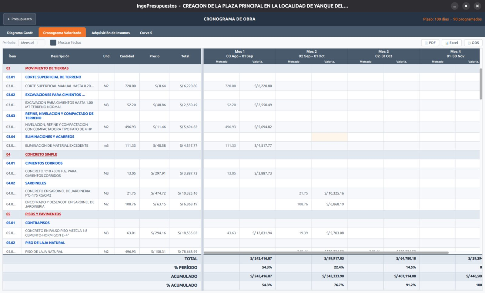

# Cronograma valorizado

El **cronograma valorizado** muestra cuánto se ejecuta —en metrado y en soles— **período por período** (normalmente por mes), repartiendo cada partida a lo largo de su duración programada en el Gantt.

## Cómo se arma

A partir de la programación del Gantt, cada partida se distribuye en los períodos que dura. Para cada mes verás dos columnas por partida:

- **Metrado** ejecutado en el período.
- **Valorización** (el monto en S/) de ese período.

Al pie, los totales por período y el acumulado.

!!! tip "Tamaño de papel"
    Como esta tabla puede ser muy ancha (muchos meses), al exportarla puedes elegir el tamaño de papel para que entre cómoda.

Este cronograma es la base de la **[Curva S](curva-s.md)** y se complementa con la **[adquisición de insumos](adquisiciones.md)**.
