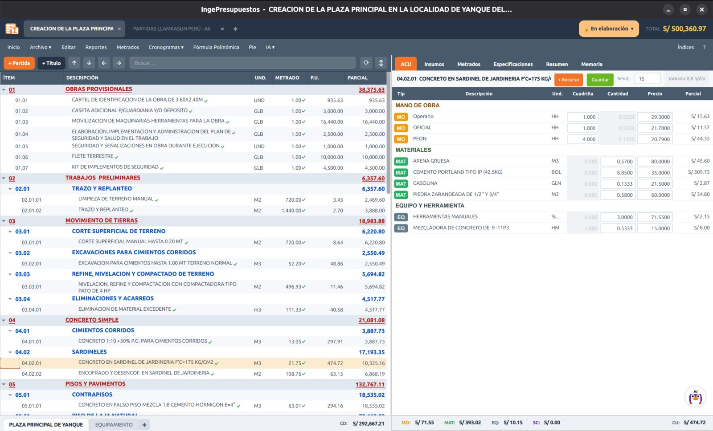

# Análisis de Costos Unitarios (ACU)

El **ACU** es el desglose del costo de una partida en mano de obra, materiales y equipo. El **precio unitario de la partida se calcula solo** a partir de este análisis.

## Cómo funciona

1. Selecciona una partida en el árbol.
2. En el panel **ACU** (a la derecha), agrega los insumos bajo cada tipo:
    - **Mano de obra** (MO)
    - **Materiales** (MAT)
    - **Equipo y herramientas** (EQ)
    - **Subcontratos** (SC)
3. Para cada insumo indicas su **cuadrilla** (en mano de obra), **cantidad** y **precio**.
4. El **parcial** de cada línea y el **precio unitario** total se calculan automáticamente.

## El rendimiento de la partida

Cada partida tiene un **rendimiento** (producción por día). De él depende la cantidad de mano de obra y equipo:

$$
\text{Cantidad de M.O.} = \frac{\text{cuadrilla}}{\text{rendimiento}} \times \text{jornada laboral}
$$

Por eso, si cambias el rendimiento, las cantidades de mano de obra y equipo se actualizan.

## Herramientas manuales y otros porcentajes

Algunos insumos se expresan como **porcentaje de la mano de obra** (por ejemplo, *Herramientas manuales = 5% MO*). Se agregan con unidad **`%MO`** (o `%MAT`) y su parcial se calcula como ese porcentaje del subtotal correspondiente. IngePresupuestos los maneja correctamente en el ACU, los insumos y los reportes.

## Guardar una partida en tu biblioteca

Puedes guardar el ACU de una partida en tu **biblioteca** para reutilizarlo en otros proyectos, con el botón **Guardar**.

Si ya existe una partida con el mismo nombre, IngePresupuestos te pregunta qué hacer:

- **Actualizar la existente** — reemplaza ese análisis con el actual.
- **Guardar como copia nueva** — la guarda en tu grupo **«Mis partidas»** sin tocar la original.
- **Cancelar.**

!!! note "Protección del catálogo base"
    Las partidas del catálogo que viene con IngePresupuestos (grupos **INGEPRESUPUESTOS**, **LLAMKASUN** y **CAPECO**) están protegidas: si guardas una con el mismo nombre, se sugiere por defecto **guardar como copia nueva**, para no alterar el catálogo original.

## Asistente para el ACU

Junto al panel hay un **chat con Tuxia**, el asistente de IA, que conoce el contexto de la partida. Puedes pedirle que sugiera el análisis, detecte incoherencias o proponga rendimientos. Ver **[Tuxia](../tuxia.md)**.

!!! tip "Precios por proyecto"
    El precio de un insumo se guarda **por proyecto**: el mismo recurso puede tener un precio distinto en otra obra. Si dentro del mismo proyecto un insumo aparece con precios distintos, IngePresupuestos lo detecta y te ofrece **unificarlo**. Ver [Insumos](insumos.md).

---

**Siguiente:** [Insumos :octicons-arrow-right-24:](insumos.md){ .md-button .md-button--primary }
