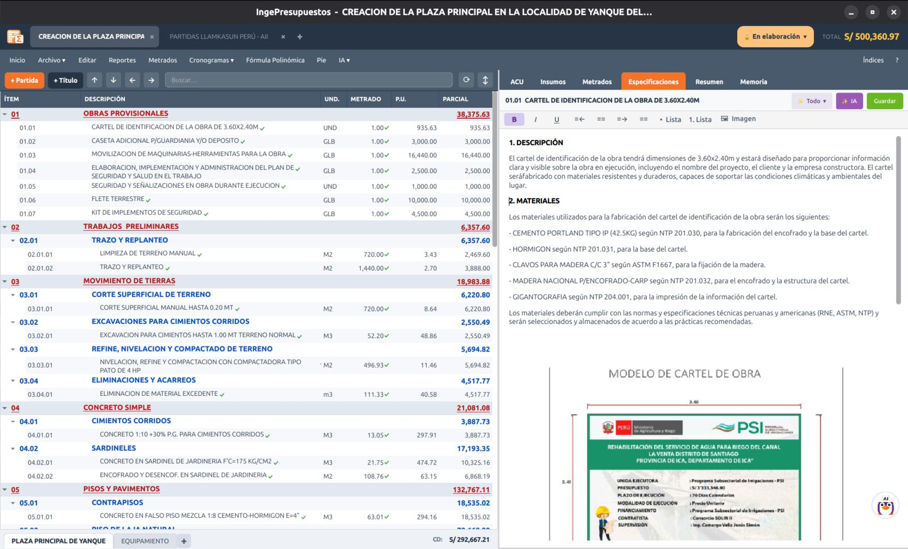

# Especificaciones técnicas

Cada partida puede llevar su **especificación técnica**: la descripción del trabajo, los materiales, el procedimiento y los criterios de aceptación. Se redactan en la pestaña **Especificaciones**.

## Redactar una especificación

1. Selecciona la partida.
2. Ve a la pestaña **Especificaciones**.
3. Escribe el texto con la barra de formato (negrita, cursiva, listas) e incluso imágenes.

## Con ayuda de IA

Puedes pedirle a **Tuxia** que redacte la especificación de una partida. La IA usa el contexto del proyecto —modalidad, plazo, notas— para proponer un texto técnico que luego editas a tu gusto. Ver **[Tuxia](../tuxia.md)**.

!!! tip "Aparecen en los reportes"
    Las especificaciones se incluyen en el reporte de **Especificaciones Técnicas** y dentro del **Reporte Completo** del expediente.
