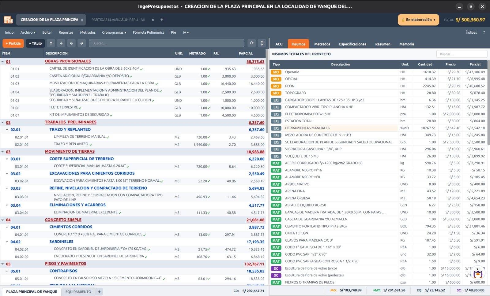

# Insumos

La pestaña **Insumos** muestra **todos los recursos del proyecto consolidados**: cada material, mano de obra, equipo y subcontrato con su precio y su incidencia total en la obra.

## Para qué sirve

- Ver de un vistazo **cuánto pesa cada insumo** en el costo total.
- **Revisar y corregir precios** en un solo lugar (cambiar el precio aquí lo actualiza en todas las partidas que lo usan).
- Detectar y resolver **inconsistencias** de precios.

## Un insumo, un precio

Dentro de un proyecto, cada insumo debería tener **un único precio**. Si el mismo recurso aparece con precios distintos en diferentes partidas (algo común al importar), IngePresupuestos lo **detecta** y te ofrece **unificarlo** al precio que elijas.

## Reemplazar un insumo

Desde la lista de insumos puedes **reemplazar** un recurso por otro en todo el proyecto — útil cuando dos insumos eran en realidad el mismo o quieres sustituir un material.

!!! note "Incluye los porcentajes"
    Los insumos de tipo porcentaje (como *Herramientas manuales %MO*) también aparecen aquí y se reparten proporcionalmente, para que el listado cuadre con el costo directo.
