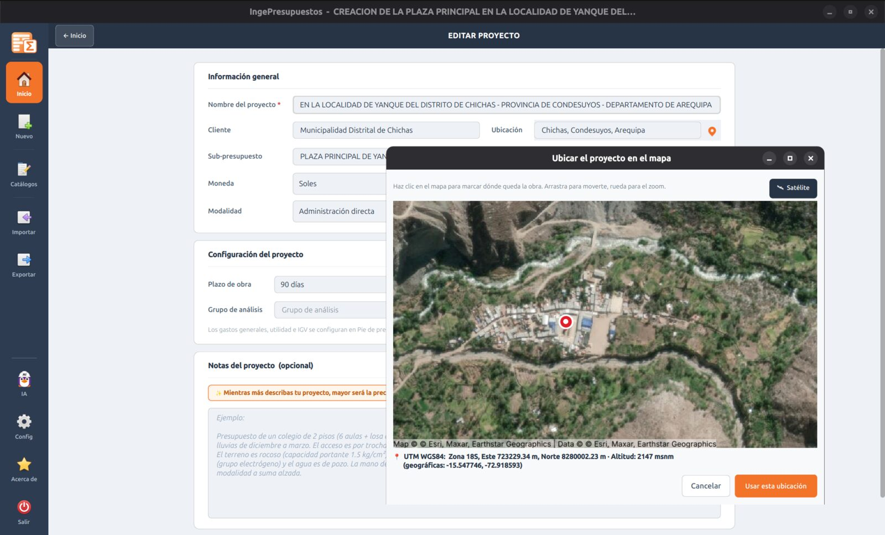

# Ubicación y mapa

IngePresupuestos te permite **geolocalizar la obra** sobre un mapa y capturar sus coordenadas, que luego enriquecen la memoria descriptiva y las especificaciones.

## Fijar la ubicación

1. Al **crear o editar** un proyecto, pulsa el botón de **ubicación en el mapa**.
2. Se abre un mapa que puedes mover y hacer zoom. Cambia entre **vista de calle** (OpenStreetMap) y **vista satelital** (Esri).
3. Haz clic en el punto exacto de la obra para colocar el **pin**.
4. Acepta. IngePresupuestos guarda:
    - La **latitud y longitud**.
    - Las coordenadas en **UTM WGS84** (el estándar de ingeniería en Perú).
    - La **altitud** del punto.

## Para qué se usa

- Mejora la **memoria descriptiva** y las **especificaciones** generadas con IA (que mencionan ubicación, zona y altitud reales).
- Deja registrada la ubicación del proyecto para el expediente.

!!! note "Funciona sin clave de API"
    El mapa usa servidores de mosaicos propios (OpenStreetMap y Esri), así que no necesitas registrar ninguna cuenta ni clave.
