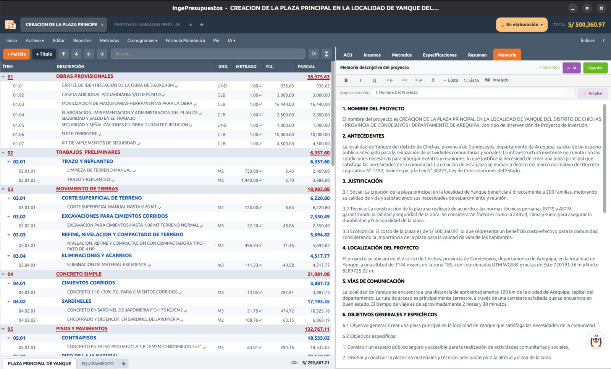

# Memoria descriptiva

La pestaña **Memoria** te permite redactar la **memoria descriptiva del proyecto** —el documento que resume antecedentes, justificación, ubicación, metas y presupuesto— con ayuda de IA y totalmente editable.

## Generarla con IA

1. Ve a la pestaña **Memoria**.
2. Completa los datos complementarios que te pida (tipo de intervención, beneficiarios, CUI si aplica, etc.).
3. Pulsa **Generar**. Tuxia redacta la memoria usando los datos del proyecto: ubicación, coordenadas, presupuesto, plazo, modalidad y tus notas.
4. **Edita** el texto con la barra de formato (negrita, listas, alineación) y agrega **imágenes** si lo necesitas.

!!! tip "Mejor con la ubicación cargada"
    Si fijaste la **ubicación en el mapa**, la memoria aprovecha las coordenadas UTM y la altitud reales. Ver [Ubicación y mapa](mapa.md).

## En los reportes

La memoria descriptiva sale como **reporte propio** (PDF, Word y ODT) y como la **primera sección del Reporte Completo** del expediente técnico.
