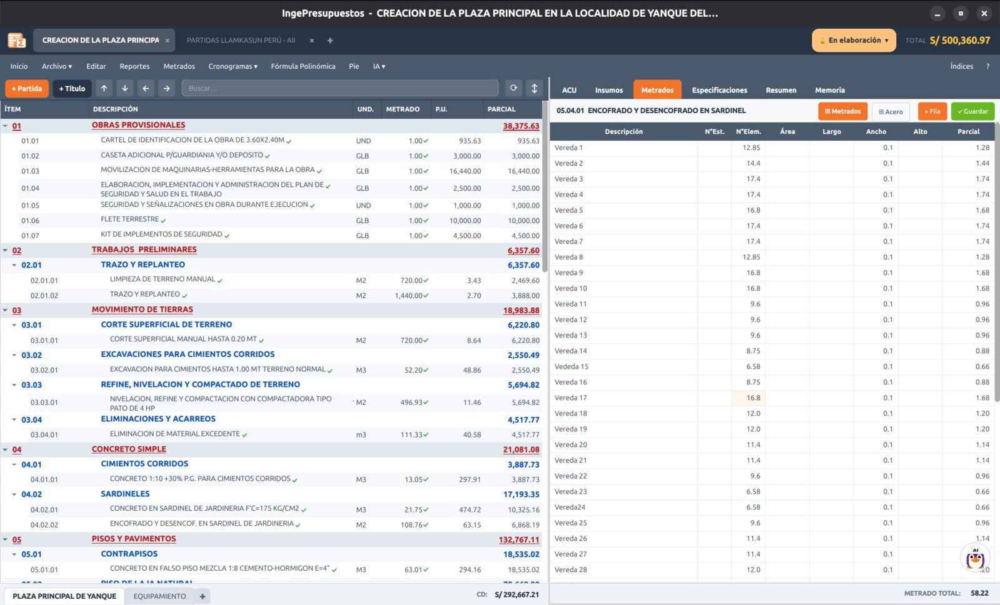
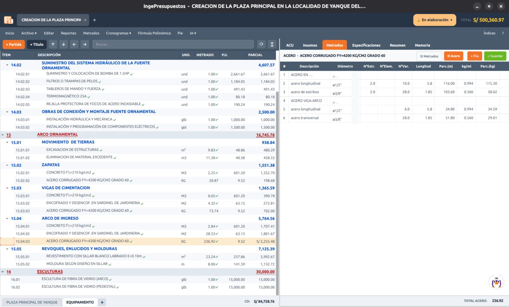

# Metrados

La **Hoja de Metrados** te permite sustentar el metrado de cada partida con una planilla detallada, en lugar de escribir un número suelto.

## La planilla

Para una partida, agregas filas con la descripción del elemento y sus dimensiones:

| Columna | Significado |
|---------|-------------|
| **Descripción** | El elemento medido (ej. «Zapata Z-1»). |
| **N° de elementos** | Cuántos elementos iguales. |
| **Largo · Ancho · Alto** | Las dimensiones. |
| **Parcial** | Se calcula automáticamente. |

El **metrado total** de la partida es la suma de los parciales, y se traslada al presupuesto.

!!! tip "Metrado manual vs. planilla"
    Puedes escribir el metrado directamente en el árbol de partidas **o** sustentarlo con la planilla. Si usas la planilla, el total manda. El formato de la Hoja de Metrados es el mismo del Presupuesto (títulos en colores, valores a 2 decimales).

## Acero de refuerzo

Para partidas de acero hay una planilla especial donde defines el acero por **diámetro**:

- Indicas el diámetro (en pulgadas, ej. `1/2"`, `5/8"`, o métrico), la longitud y el número de elementos.
- IngePresupuestos calcula el **peso en kg** según la tabla de pesos por metro lineal (NTP).

!!! note "Diámetros"
    Si escribes un diámetro sin comilla (ej. `1/2`), se interpreta como pulgadas (`1/2"`). Los diámetros métricos se dejan tal cual.
