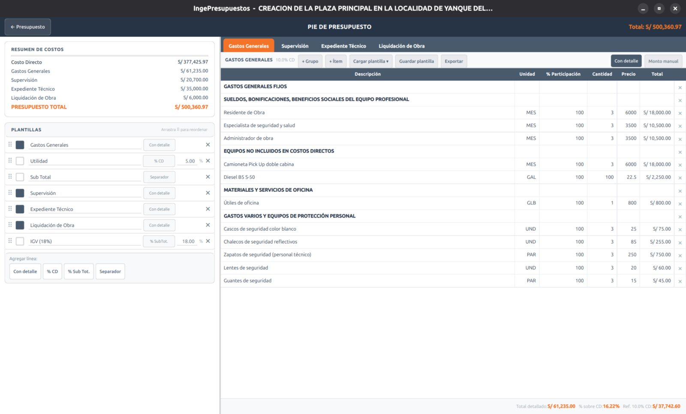

# Pie de presupuesto

El **pie de presupuesto** son los rubros que se suman al costo directo para llegar al presupuesto total: gastos generales, utilidad, IGV, supervisión, expediente técnico, liquidación, etc.



## Cómo se calcula el total

```
Costo Directo  (suma de todas las partidas)
+ Gastos Generales
+ Utilidad
= Subtotal
+ IGV
= Presupuesto Total
```

Cada proyecto puede activar los rubros que necesite (supervisión, expediente, liquidación, controversias, etc.).

!!! note "Al importar entran desactivados"
    Cuando importas de otro programa, todos los rubros del pie se cargan **desactivados** para no asumir valores que no correspondan. Actívalos y ajústalos según tu obra.

## Rubros con detalle (modelo «Cantidad»)

Algunos rubros, como los **gastos generales**, se pueden detallar línea por línea. Cada línea se calcula:

$$
\text{Total} = \text{cantidad} \times \frac{\%\text{participación}}{100} \times \text{precio}
$$

Esto te permite sustentar, por ejemplo, el sueldo de un residente al 100% de participación durante todo el plazo, o un equipo al 50%.

Cada rubro puede llevarse de dos formas, con el selector **Con detalle / Monto manual**:

- **Con detalle** — la tabla línea por línea de arriba.
- **Monto manual** — un único importe que escribes directamente.

En ambos casos, el **total del rubro** se muestra arriba, junto al selector, para verlo sin bajar al pie.

## Plantillas precargadas

Para no empezar de cero, IngePresupuestos trae **plantillas** de gastos generales, supervisión, expediente y liquidación (basadas en estructuras tipo CAPECO). Úsalas con el botón **Cargar plantilla** y ajusta los montos a tu proyecto.

## Firmas

En el pie también defines los profesionales responsables (proyectista, jefe de proyecto, etc.) que aparecen en las firmas de los reportes.
