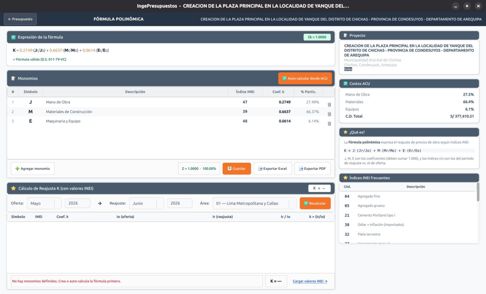

# Fórmula polinómica

La **fórmula polinómica** permite reajustar el monto de la obra ante la variación de precios, según el D.S. 011-79-VC. IngePresupuestos la **deriva automáticamente** de tu presupuesto.

## Cómo se genera

A partir del análisis de costos del proyecto, IngePresupuestos agrupa los insumos por **índice unificado (INEI)** y calcula la incidencia de cada uno, derivando los monomios de **mano de obra (J)**, **materiales (M)**, **equipo (E)** y los que correspondan.

## Validaciones del D.S. 011-79-VC

El programa verifica que la fórmula cumpla la norma:

- La **suma de los coeficientes** de cada monomio es igual a **1**.
- Cada **incidencia** es **mayor o igual a 5%**.
- Como **máximo 8 monomios**.

## Índices INEI

Cada monomio se asocia a un **índice unificado del INEI** (hay 72 códigos en 6 áreas geográficas). IngePresupuestos los detecta y mantiene actualizados.

!!! note "No aplica en Administración Directa"
    La fórmula polinómica es propia de obras por contrata. En proyectos con modalidad **Administración Directa**, el programa (y el asistente de IA) la omite, ya que no corresponde.
