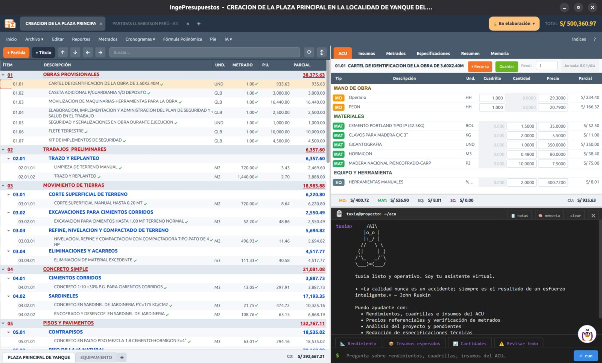

# El panel principal

Al abrir IngePresupuestos llegas al **panel principal (dashboard)**: la lista de todos tus proyectos. Desde aquí los creas, abres, organizas e importas.

## Acciones rápidas

- **Nuevo proyecto** — crea un presupuesto desde cero.
- **Importar** — trae un proyecto desde S10, Delphin, PowerCost, Excel, etc.
- **Abrir** — haz clic en cualquier proyecto para entrar.
- **Clic derecho** sobre un proyecto — menú con opciones (duplicar, mover a portafolio, eliminar…).

## Organizar con portafolios

Cuando manejas muchos proyectos, los **portafolios** te ayudan a agruparlos y encontrarlos rápido. Un portafolio es como una carpeta de color: puedes crear uno por **cliente**, por **año**, por **región** o como te convenga.

<!-- CAPTURA: barra de portafolios del dashboard (los tags de colores + "Nuevo portafolio") -->

### Crear un portafolio

1. En la barra de portafolios (arriba de la lista), pulsa **Nuevo portafolio**.
2. Ponle un **nombre**, elige un **color** y, si quieres, una descripción.
3. Acepta. Aparece como un **tag de color** en la barra.

### Asignar proyectos

- **Clic derecho** sobre un proyecto → **Mover a portafolio** → elige el portafolio.
- Cada proyecto muestra su portafolio como un pequeño chip de color en su tarjeta.

### Filtrar por portafolio

Haz clic en el **tag** de un portafolio para ver solo sus proyectos. Hay también un filtro **«Sin clasificar»** para los que aún no tienen portafolio, y uno para ver **todos**.

!!! tip "Los portafolios son solo para organizarte"
    Agrupar proyectos no cambia su contenido ni sus cálculos: es únicamente una ayuda para encontrarlos y ordenarlos en el panel.

## El estado de cada proyecto

Cada proyecto muestra su **estado** (En elaboración, En revisión, Aprobado, Ejecutado) como una etiqueta. El estado controla qué partes del proyecto se pueden editar. Lo explicamos en detalle en **[Estados del proyecto](../elaborar/estados.md)**.

---

**Siguiente paso:** [Tu primer proyecto :octicons-arrow-right-24:](primer-proyecto.md){ .md-button .md-button--primary }
