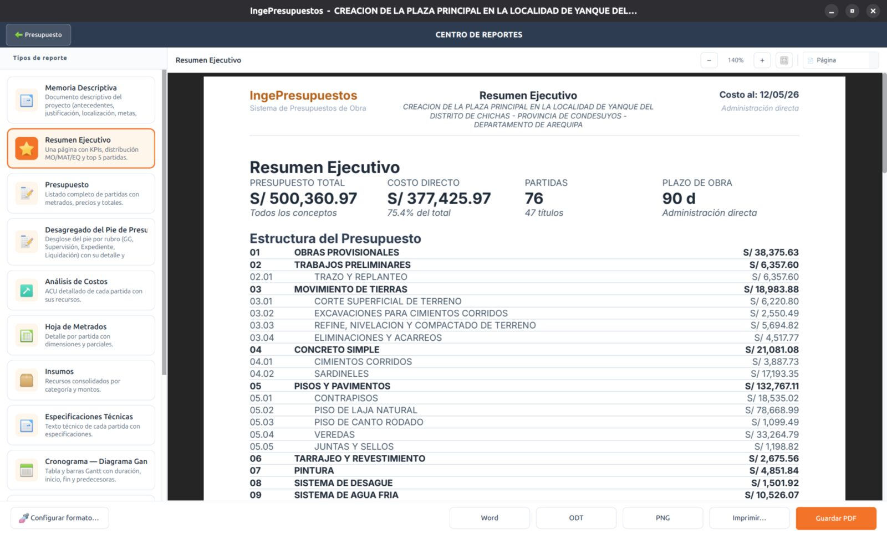

# Centro de Reportes

El **Centro de Reportes** es donde generas todos los documentos del expediente. Eliges el reporte a la izquierda, lo ves en **vista previa en vivo** al centro, y lo exportas al formato que necesites.

## Cómo generar un reporte

1. Abre el proyecto y entra al **Centro de Reportes**.
2. Selecciona el reporte en la lista lateral.
3. Revísalo en la **vista previa**.
4. Pulsa **Guardar PDF** o elige otro formato (Excel, Word, ODS, ODT).

## Encabezado y pie con tu marca

Todos los reportes llevan un encabezado con el **logo y los datos de tu empresa**, el nombre del proyecto y el costo, y un pie tripartito con numeración automática de páginas. Configura tu marca en **Configuración → Reportes**.

## El Reporte Completo

El **Reporte Completo** une todos los reportes en un solo PDF (memoria, presupuesto, ACU, metrados, insumos, especificaciones, cronogramas, fórmula…), con **numeración global** continua. Ideal para entregar el expediente técnico de una sola vez.

También existen los **packs** Office (Word/Excel) y LibreOffice (ODT/ODS) para entregar todo en formato editable.

[:octicons-arrow-right-24: Ver los tipos de reporte](tipos.md){ .md-button }
[:octicons-arrow-right-24: Exportar a Excel, Word y más](exportar.md){ .md-button }
