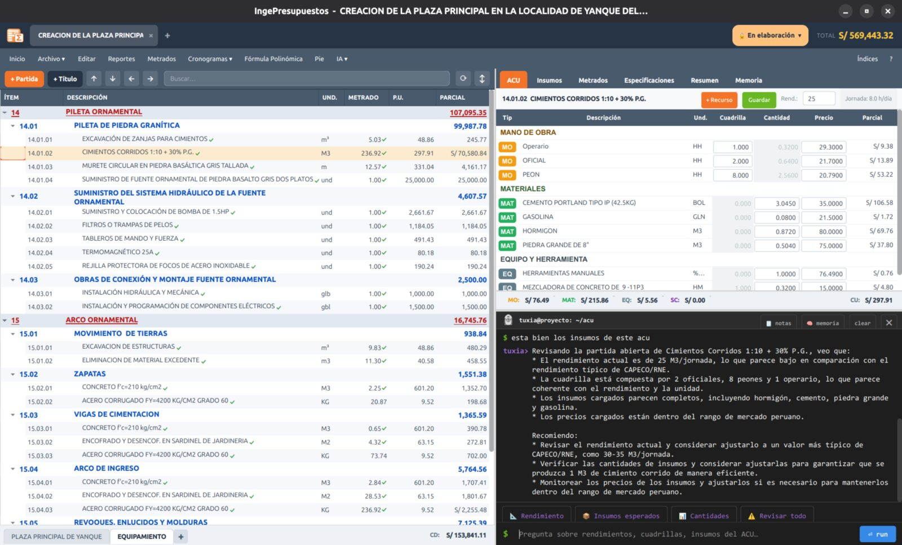

# Tuxia — Inteligencia Artificial

**Tuxia** es el asistente de IA integrado en IngePresupuestos. Entiende el contexto de tu proyecto y te ayuda a analizar partidas, redactar especificaciones y memoria, detectar incoherencias y sugerir precios.



## Configurar Tuxia

Tuxia funciona con tu **propia clave de API** del proveedor que prefieras. Lo bueno: **solo tienes que pegar la clave** — Tuxia reconoce el proveedor automáticamente por el formato de la clave. No tienes que elegirlo a mano.

1. Ve a **Configuración → Inteligencia Artificial**.
2. Pega tu **API key** en el campo correspondiente.
3. Guarda. Tuxia queda activo en todos tus proyectos.

<!-- CAPTURA: Configuración → Inteligencia Artificial, con el campo de API key -->

### Proveedores compatibles

Elige **uno** según tu preferencia. Cada clave empieza con un prefijo distinto, y por eso Tuxia sabe cuál es:

| Proveedor | La clave empieza con | Costo | Dónde obtenerla |
|-----------|----------------------|-------|-----------------|
| **Groq** | `gsk_` | **Gratis** | [console.groq.com](https://console.groq.com) |
| **Google Gemini** | `AIza` | Capa **gratuita** | [aistudio.google.com](https://aistudio.google.com/apikey) |
| **Anthropic (Claude)** | `sk-ant-` | De pago | [console.anthropic.com](https://console.anthropic.com) |
| **OpenAI (GPT)** | `sk-` | De pago | [platform.openai.com](https://platform.openai.com/api-keys) |
| **OpenRouter** | `sk-or-` | Varía (muchos modelos) | [openrouter.ai](https://openrouter.ai/keys) |

!!! tip "¿Recién empiezas? Usa Groq"
    **Groq es gratis** y rápido. Crea una cuenta en [console.groq.com](https://console.groq.com), genera una clave (empieza con `gsk_`), pégala en IngePresupuestos y listo. Es la forma más fácil de probar Tuxia sin pagar nada.

### Opción local: Ollama (gratis y offline)

Si prefieres que **nada salga de tu PC**, usa **[Ollama](https://ollama.com)** con un modelo local:

1. Instala Ollama y descarga un modelo, por ejemplo:

    ```bash
    ollama pull llama3.2
    ```

2. En IngePresupuestos: **Configuración → Inteligencia Artificial**, elige **Ollama** como proveedor.
3. Indica la **URL** (por defecto `http://localhost:11434`) y el **modelo** (ej. `llama3.2`).

Así tienes IA **gratis, sin clave y sin conexión a internet**. La calidad de las respuestas depende del modelo local que uses.

!!! note "¿Qué modelo usa cada proveedor?"
    Tuxia usa por defecto un modelo equilibrado de cada proveedor (Groq: *Llama 3.3 70B* · Gemini: *2.0 Flash* · Claude: *Haiku* · OpenAI: *GPT-4o mini*). Son rápidos y económicos; suficientes para asistir en presupuestos.

## Qué puede hacer

**Por partida:**

- Sugerir el **análisis de costos** o el **rendimiento**.
- Redactar la **especificación técnica**.
- Responder dudas en el **chat** contextual del ACU.

**Por proyecto:**

- **Validar el proyecto** (te da un semáforo 🔴/🟡/🟢 con observaciones).
- Redactar la **memoria descriptiva**.
- Conversar sobre el conjunto del presupuesto.

!!! note "Tus datos"
    Las consultas a Tuxia se envían al proveedor de IA que tú configures con tu clave. Si prefieres no enviar nada a la nube, usa **Ollama** en local.
